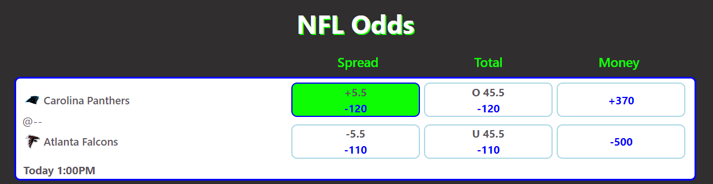

# Getting Started with CAM Sportsbook

## How to make bets

If you are familiar with betting at online sportsbooks such as betMGM or FanDuel then you already know how to navigate this app. CAM Sportsbook is modeled after the top online sprotsbooks in the industry. However, if you are new to the betting world then please keep reading.

### `Choosing a Sport`

Use the navigation menu to choose which sport you would like to bet on, unless you wish to bet on the sport that is displayed on the homepage. You have the option of the NFL, MLB, NBA, or NCAAF (College Football). Once you have chosen your sport you will then be presented with a list of games to bet on.

### `Wager Types`

For each game, you will have at most 3 wager types that you can make. (Note: some wager types may not have data provided yet from the api and will appear blank for the time being). The wager types are as follows:

- Spread
  \*\*Indicates the expected result of the game. From the screenshot above, the Carolina Panthers (+5.5) are expected to lose by 5.5 points. By choosing this wager, you are betting that they lose by less than this amount (or possibly even win). The Atlanta Falcons (-5.5) are expected to win by 5.5 points. By choosing the falcons, you are betting that they will win by more than 5.5 points

- Total
  \*\*Indicates the expected combined points scored by both teams. Using the screenshot (O 45.5) means that you are betting for the two teams to combine for Over 45.5 points scored. (U 45.5) means you are betting for the teams to score Under 45.5 points.

- Moneyline
  \*\*Indicates which team you think will win the game. The margin of victory does not matter

### `Wager Price`

For each wager type there appears a blue number which represents the wager price and is either positive or negative.

- Negative
  \*\*A negative wager price indicates that you must bet that amount in order to win $100. For instance, a price of (-105) means that for every $105 you bet, you would win $100. However, if you lose, then you lose the full $105.

- Positive
  \*\*A positive wager price indicates that for every $100 that you bet, you will win that amount. For example if the price is (+250) then for every $100 you bet you will win $250. However, if you lose then you only lose the $100.

Lets look at the screenshot to go over some example wagers:

- The green box above (which is the color a box will turn when you choose to make that bet) says +5.5 in black and -120 in blue and is next to the Carolina Panthers. Therefore, you are betting that the Panthers don't lose by 6 or more points and for every $120 you bet you can win $100. So if you choose this box and bet $60 and the Panthers lose by 3 points, you will win $50. This is because you are paid .833 (100/120) times what you bet.

- If you choose the box on the top right (Moneyline) that says +370 in blue and is next to the Carolina Panthers then you are betting that the Panthers will win the game and you will be paid $370 for every $100 that you bet. Therefore, if you bet $60 and the Panthers win you will win $222. This is because you are paid 3.7 (370/100) times what you bet.

### `Making a Wager`
